---
## Front matter
title: "Отчёт по лабораторной работе 3"
subtitle: "Система контроля версий Git"
author: "Сидорова Наталья Андреевна"

## Generic otions
lang: ru-RU
toc-title: "Содержание"

## Bibliography
bibliography: bib/cite.bib
csl: pandoc/csl/gost-r-7-0-5-2008-numeric.csl

## Pdf output format
toc: true # Table of contents
toc-depth: 2
lof: true # List of figures
lot: true # List of tables
fontsize: 12pt
linestretch: 1.5
papersize: a4
documentclass: scrreprt
## I18n polyglossia
polyglossia-lang:
  name: russian
  options:
	- spelling=modern
	- babelshorthands=true
polyglossia-otherlangs:
  name: english
## I18n babel
babel-lang: russian
babel-otherlangs: english
## Fonts
mainfont: PT Serif
romanfont: PT Serif
sansfont: PT Sans
monofont: PT Mono
mainfontoptions: Ligatures=TeX
romanfontoptions: Ligatures=TeX
sansfontoptions: Ligatures=TeX,Scale=MatchLowercase
monofontoptions: Scale=MatchLowercase,Scale=0.9
## Biblatex
biblatex: true
biblio-style: "gost-numeric"
biblatexoptions:
  - parentracker=true
  - backend=biber
  - hyperref=auto
  - language=auto
  - autolang=other*
  - citestyle=gost-numeric
## Pandoc-crossref LaTeX customization
figureTitle: "Рис."
tableTitle: "Таблица"
listingTitle: "Листинг"
lofTitle: "Список иллюстраций"
lotTitle: "Список таблиц"
lolTitle: "Листинги"
## Misc options
indent: true
header-includes:
  - \usepackage{indentfirst}
  - \usepackage{float} # keep figures where there are in the text
  - \floatplacement{figure}{H} # keep figures where there are in the text
---

# Цель работы

Изучить идеологию и применение средств контроля версий. Приобрести практические навыки по работе с системой git.

# Выполнение лабораторной работы

1. Мы создали учетную запись на сайте github.com и заполнили основные данные (рис. [-@fig:001])

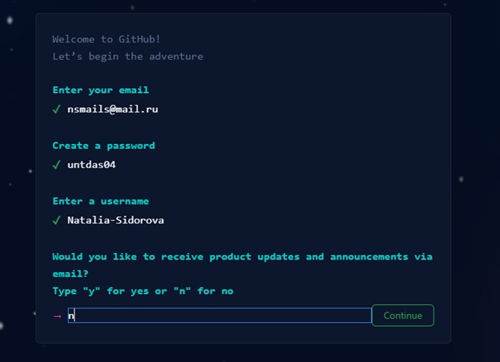{ #fig:001 width=100% }

(рис. [-@fig:002])

{ #fig:002 width=100% }

2. Сделали предварительную конфигурацию git, указав в терминале с помощью команд git config --global имя и email владельца репозитория. Затем с помощью команды git config --global core.quotepath false настроили utf-8 в выводе сообщений git. Задали имя начальной ветки – master с помощью команды git config --global init.defaultBranch master. Задали параметр autocrlf с помощью команды git config --global core.autocrlf input. Задали параметр safecrlf с помощью команды git config --global core.safecrlf warn (рис. [-@fig:003])

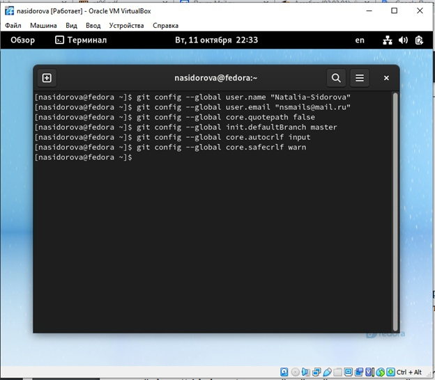{ #fig:003 width=100% }

3. Сгенерировали ssh ключи для идентификации пользователя на сервере репозиториев с помощью команды ssh-keygen –C. Ключи сохранятся в каталоге ~/.ssh/ (рис. [-@fig:004])

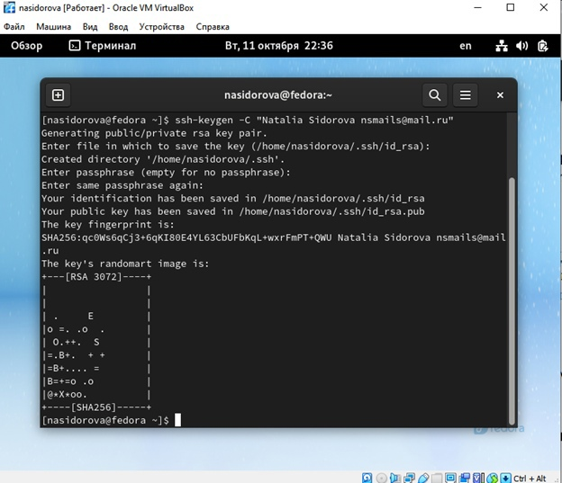{ #fig:004 width=100% }

4. Мы загрузили сгенерированный открытый ключ. Для этого зашли на сайт github.org под своей учётной записью и перешли в меню Setting . Выбрали в боковом меню SSH and GPG keys и нажали кнопку New SSH key . Скопировали из локальной консоли ключ в буфер обмена с помощью команды cat ~/.ssh/id_rsa.pub | xclip -sel clip и вставили ключ в появившееся на сайте поле, также указали имя для ключа (Title) (рис. [-@fig:005])

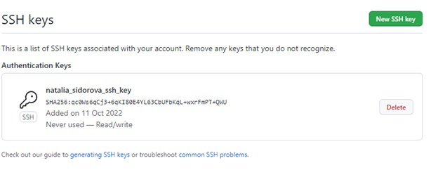{ #fig:005 width=100% }

(рис. [-@fig:006])

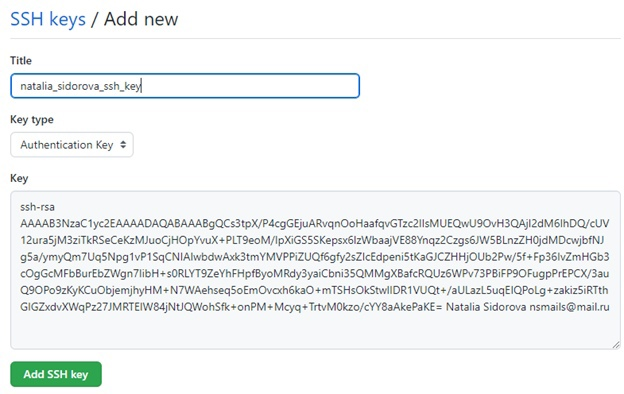{ #fig:006 width=100% }

(рис. [-@fig:007])

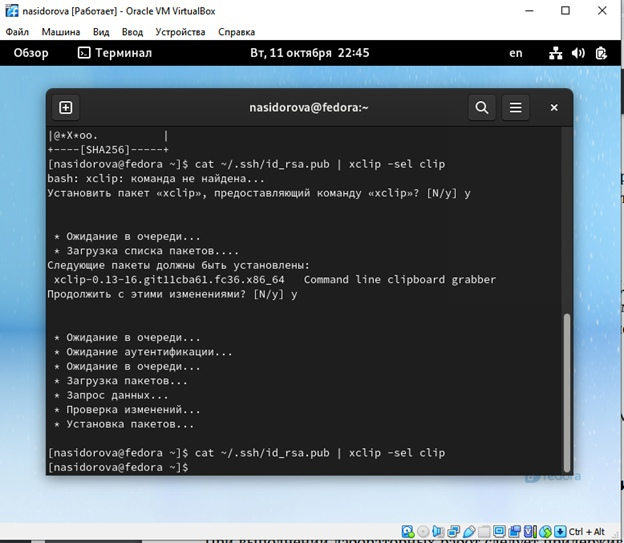{ #fig:007 width=100% }

5. Мы создали каталог для предмета «Архитектура компьютера» с помощью команды mkdir – p (рис. [-@fig:008])

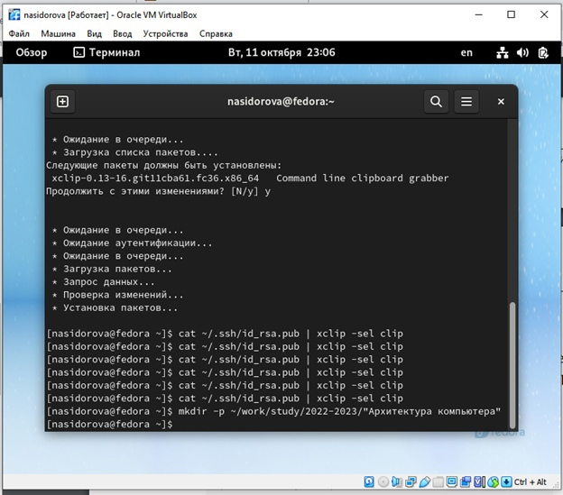{ #fig:008 width=100% }

6. Перешли на станицу репозитория с шаблоном курса https://github.com/yam adharma/course-directory-student-template. Далее выбрали Use this template (рис. [-@fig:009])

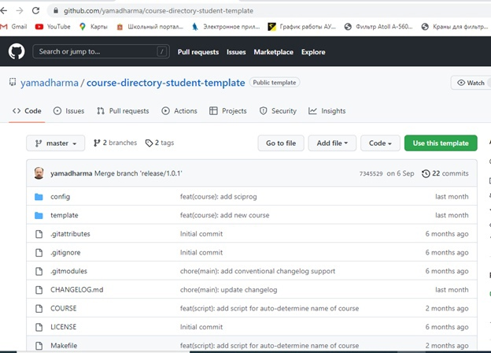{ #fig:009 width=100% }

7. Задали имя репозитория и создали его (рис. [-@fig:010])

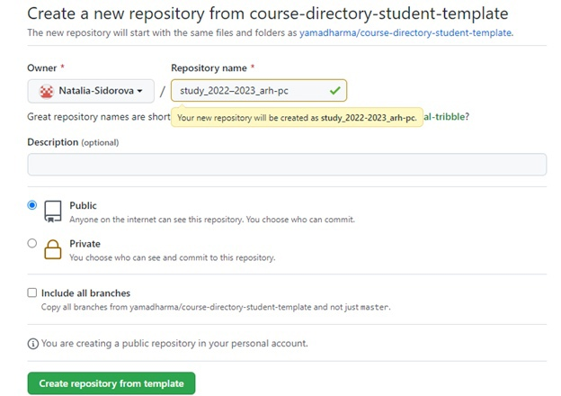{ #fig:010 width=100% }

8. Скопировали ссылку для клонирования на странице созданного репозитория, нажав на Code и выбрав SSH (рис. [-@fig:011])

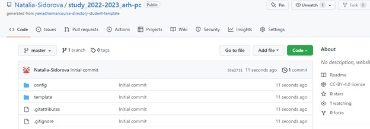{ #fig:011 width=100% }

(рис. [-@fig:012])

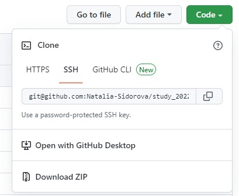{ #fig:012 width=100% }

9. В терминале перешли в каталог курса с помощью команды cd и клонировали репозиторий с помощью команды git clone –recursive (рис. [-@fig:013])

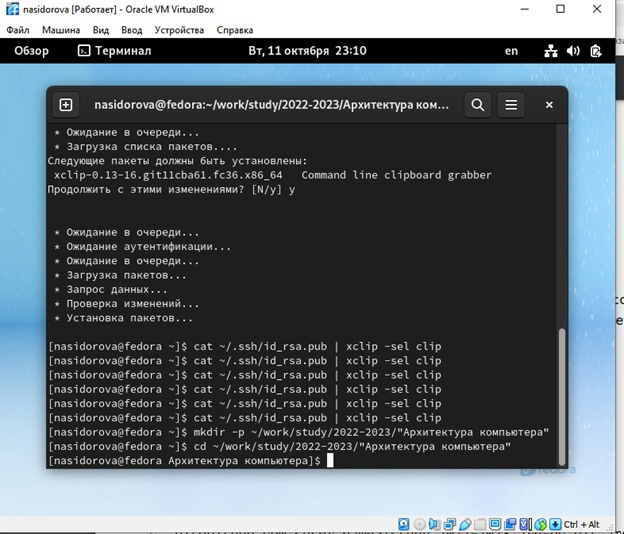{ #fig:013 width=100% }

(рис. [-@fig:014])

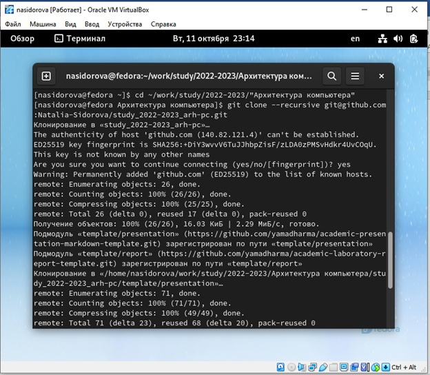{ #fig:014 width=100% }

(рис. [-@fig:015])

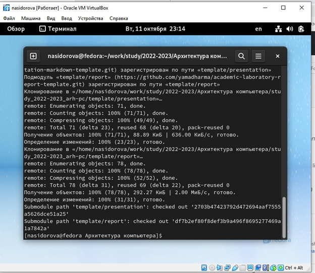{ #fig:015 width=100% }

10. С помощью команды cd перешли в каталог курса, затем с помощью команды rm package.json удалили лишние файлы (рис. [-@fig:016])

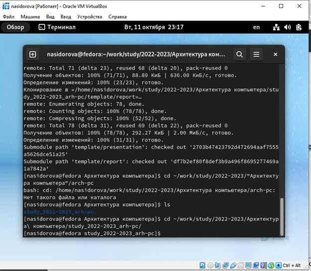{ #fig:016 width=100% }

(рис. [-@fig:017])

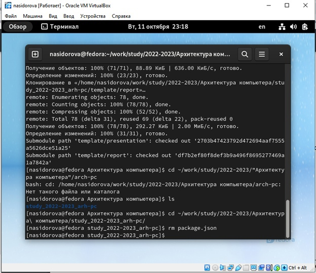{ #fig:017 width=100% }

11. С помощью команды echo arch-pc > COURSE 
make создали необходимые каталоги (рис. [-@fig:018])

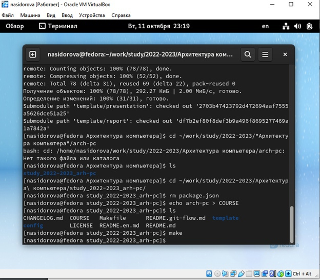{ #fig:018 width=100% }

12. С помощью серии команд 
git add 
git commit -am 'feat(main): make course structure'
git push
отправили файлы на сервер (рис. [-@fig:019])

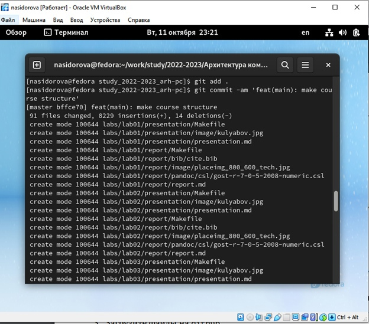{ #fig:019 width=100% }

(рис. [-@fig:020])

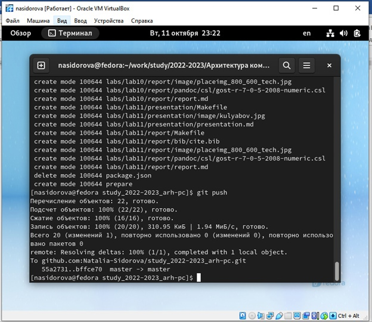{ #fig:020 width=100% }

13. С помощью команды ls проверили правильность создания иерархии рабочего пространства в локальном репозитории и на странице github. В репозитории и на странице github каталоги совпадают (рис. [-@fig:021])

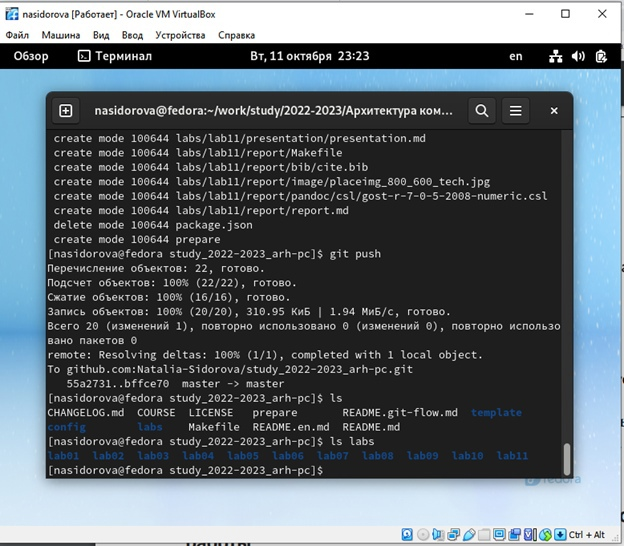{ #fig:021 width=100% }

(рис. [-@fig:022])

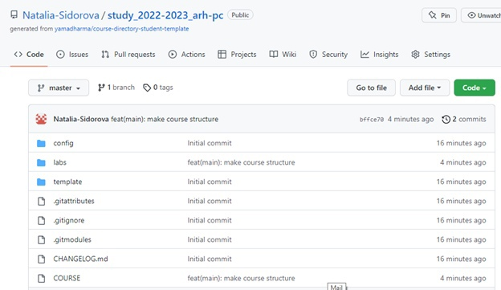{ #fig:022 width=100% }

(рис. [-@fig:023])

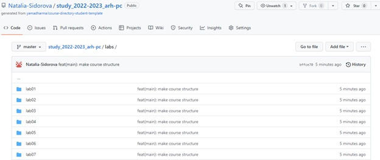{ #fig:023 width=100% }

Задания для самостоятельной работы.
1. Мы создали отчет по выполнению лабораторной работы в соответствующем каталоге рабочего пространства
2. Мы скопировали отчеты по выполнению предыдущих лабораторных работ в соответствующие каталоги созданного рабочего пространства (рис. [-@fig:024])

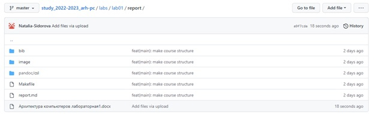{ #fig:024 width=100% }

(рис. [-@fig:025])

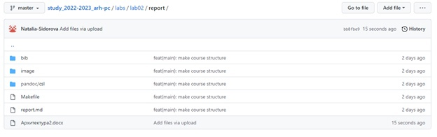{ #fig:025 width=100% }

(рис. [-@fig:026])

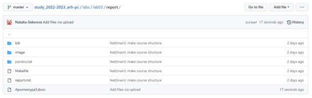{ #fig:026 width=100% }

3. Мы загрузили файлы на github

# Выводы

В процессе выполнения лабораторной работы мы изучили идеологию и применение средств контроля версий, приобрели практические навыки по работе с системой git: 
•	Базовая настройка git;
•	Создание рабочего пространства и репозитория;
•	Настройка каталога и синхронизация с сервером.

# Список литературы{.unnumbered}

::: {#refs}
:::
