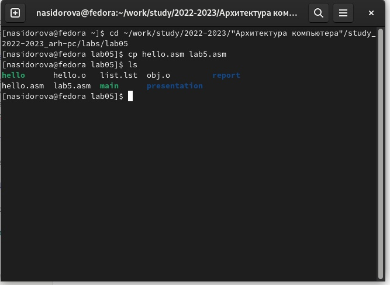

---
## Front matter
title: "Отчёт по лабораторной работе 5"
subtitle: "Создание и процесс обработки программ на языке ассемблера NASM"
author: "Сидорова Наталья Андреевна"

## Generic otions
lang: ru-RU
toc-title: "Содержание"

## Bibliography
bibliography: bib/cite.bib
csl: pandoc/csl/gost-r-7-0-5-2008-numeric.csl

## Pdf output format
toc: true # Table of contents
toc-depth: 2
lof: true # List of figures
lot: true # List of tables
fontsize: 12pt
linestretch: 1.5
papersize: a4
documentclass: scrreprt
## I18n polyglossia
polyglossia-lang:
  name: russian
  options:
	- spelling=modern
	- babelshorthands=true
polyglossia-otherlangs:
  name: english
## I18n babel
babel-lang: russian
babel-otherlangs: english
## Fonts
mainfont: PT Serif
romanfont: PT Serif
sansfont: PT Sans
monofont: PT Mono
mainfontoptions: Ligatures=TeX
romanfontoptions: Ligatures=TeX
sansfontoptions: Ligatures=TeX,Scale=MatchLowercase
monofontoptions: Scale=MatchLowercase,Scale=0.9
## Biblatex
biblatex: true
biblio-style: "gost-numeric"
biblatexoptions:
  - parentracker=true
  - backend=biber
  - hyperref=auto
  - language=auto
  - autolang=other*
  - citestyle=gost-numeric
## Pandoc-crossref LaTeX customization
figureTitle: "Рис."
tableTitle: "Таблица"
listingTitle: "Листинг"
lofTitle: "Список иллюстраций"
lotTitle: "Список таблиц"
lolTitle: "Листинги"
## Misc options
indent: true
header-includes:
  - \usepackage{indentfirst}
  - \usepackage{float} # keep figures where there are in the text
  - \floatplacement{figure}{H} # keep figures where there are in the text
---

# Цель работы

Освоение процедуры компиляции и сборки программ, написанных на ассемблере NASM.

# Выполнение лабораторной работы

1. Создала каталог для работы с программами на языке ассемблера NASM. Перешла в созданный каталог. Создала текстовый файл с именем hello.asm (рис. [-@fig:001])

{ #fig:001 width=100% }

2. Открыла данный файл в текстовом редакторе и ввела данный текст программы. (рис. [-@fig:002])

{ #fig:002 width=100% }

3. Скомпилировала текст программы (рис. [-@fig:003])

{ #fig:003 width=100% }

4. С помощью команды ls проверила, что был создан объектный файл с именем hello.o (рис. [-@fig:004])

{ #fig:004 width=100% }

5. С помощью команды nasm -o obj.o -f elf -g -l list.lst hello.asm скомпилировала исходный файл hello.asm в obj.o и создала файл листинга list.lst. С помощью команды ls убедилась, что данные файлы созданы (рис. [-@fig:005])

{ #fig:005 width=100% }

6. Передала объектный файл на обработку компоновщику. С помощью команды ls проверила, что исполняемый файл hello был создан. С помощью команды ld -m elf_i386 obj.o -o main создала исполняемый файл main. Этот исполняемый файл создан из объектного файла obj.o. (рис. [-@fig:006])

{ #fig:006 width=100% }

7. Запустила созданный исполняемый файл (рис. [-@fig:007])

{ #fig:007 width=100% }

Самостоятельная работа.
1. В каталоге lab05 создала копию файла hello.asm с именем lab5.asm (рис. [-@fig:008])

{ #fig:008 width=100% }

2. С помощью текстового редактора изменила текст программы в файле lab5.asm так, чтобы вместо Hello world! на экран выводилась строка с моей фамилией и именем (рис. [-@fig:009])

{ #fig:009 width=100% }

3. Оттранслировала полученный текст программы lab5.asm в объектный
файл. Выполнила компоновку объектного файла и запустила получившийся исполняемый файл (рис. [-@fig:010])

{ #fig:010 width=100% }

4. Скопировала файлы hello.asm и lab5.asm в локальный репозиторий в каталог lab05 (они уже там находились) и загрузила файлы на Github (рис. [-@fig:011])

{ #fig:011 width=100% }

# Выводы

Освоила процедуры компиляции и сборки программ, которые написаны на ассемблере NASM.

# Список литературы{.unnumbered}

::: {#refs}
:::
